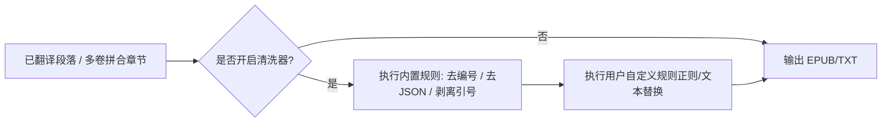

# EPUB 导出期文本清洗与残余过滤机制（Export Sanitizer Pipeline）设计方案

## 一、 背景与诉求

1. **痛点问题**：
   - 机器翻译（LLM）偶尔因模型幻觉或 Fallback 降级，在译文段落中产生语法残渣：
     1. **标号残留**：段首带有 `[1]`、`[2]`、`(1)`、`1.` 等输入标号。
     2. **JSON/结构残余**：段首/段中偶发带有 `{"paragraphs":`、`{"p1":`、`{"translation":`、`}`、`[` 等。
     3. **半角双引号溢出**：因 JSON 字符串外层剥离不全，段首段尾带有未配对的英文半角双引号 `"`（与中文全角对话引号 `“` `”` 混杂）。
2. **目标**：
   - 在导出 EPUB / TXT 时建立一道**自动清洗过滤管线**。
   - 默认开启内置清洗规则（无感知解决上述 3 类典型问题）。
   - 提供 UI 开关（复选框/RadioButton）与**自定义过滤规则弹窗**，允许用户添加自定义正则/文本替换规则，应对未来各种未知的残余情况。

---

## 二、 核心过滤规则设计（内置默认规则）

清洗器接收每个段落字符串 `paragraph`，按流水线顺序执行清洗：

### 1. 标号剥离（Index Stripper）
- **匹配模式**：`^\s*(\[|\()?\d+(\]|\)|\.|\:|\、|\s)+\s*`
- **示例**：
  - `[1] 男人平静地解释着。` $\rightarrow$ `男人平静地解释着。`
  - `(12) “快点走吧。”` $\rightarrow$ `“快点走吧。”`
  - `3. 晨曦穿透了薄雾。` $\rightarrow$ `晨曦穿透了薄雾。`

### 2. JSON 结构键名与代码残余清除（JSON Residue Cleaner）
- **匹配模式**：`^\s*\{?\"(paragraphs|translation|text|content|p\d+)\"\s*\:\s*\[?`
- **示例**：
  - `{"paragraphs": ["阳光洒满大地。` $\rightarrow$ `阳光洒满大地。`
  - `"p1": "夜色渐浓。"` $\rightarrow$ `夜色渐浓。`

### 3. 外层半角双引号精准剥离（Double-Quote Sanitizer）
- **区分原理**：
  - 中文小说正文对话使用全角引号 `“` (U+201C) 和 `”` (U+201D)。
  - JSON 语法包裹使用半角双引号 `"` (U+0022)。
- **剥离策略**：
  1. 若段落以英文 `"` 开头，且后紧跟中文引号 `“`（如 `"“快跑！”"`），剥离最外层英文 `"`。
  2. 若段落以英文 `"` 开头，结尾是句号/问号/叹号且无闭合英文 `"`（单边悬空），直接剔除首尾英文 `"`。
  3. 若整段被英文 `"` 包裹且内部无其他半角引号，剥离首尾 `"`。

---

## 三、 UI 交互与配置弹窗设计

### 1. 界面控件（多卷合并 Tab 与 主设置区）
- **复选框**：`☑ 导出时自动清洗翻译残余`（默认勾选）
- **操作按钮**：`⚙ 自定义清洗规则...`（点击打开配置弹窗）

### 2. 自定义规则配置弹窗 (`SanitizerRuleDialog`)
- **弹窗内容**：
  - **内置规则开关列表**：
    - `☑ 自动清除段首段落编号 [1] / 1. 等`
    - `☑ 自动清除 JSON 结构残渣 {"paragraphs": 等`
    - `☑ 自动修正外层未剥离半角引号 "`
  - **自定义正则/文本替换列表（可增删改）**：
    - 表格列：`模式类型 (正则/文本)` | `查找内容` | `替换为 (默认空)` | `启用状态`
    - 提供预设模板与简易测试框（输入一段测试文本，实时预览清洗后的效果）。
- **持久化存储**：保存在 `.gui_config.json` 或 `.sanitizer_rules.json` 中，跨会话记忆。

---

## 四、 架构与数据流设计



### 伪代码实现

```python
class ExportSanitizer:
    def __init__(self, config: AppConfig, custom_rules: list[dict] | None = None):
        self.enabled = config.enable_sanitizer
        self.custom_rules = custom_rules or []

    def clean_paragraph(self, text: str) -> str:
        if not self.enabled or not text:
            return text
        
        # 1. 内置：去除段首残留编号 [1], 1., (1) 等
        text = re.sub(r"^\s*(\[|\()?\d+(\]|\)|\.|\:|\、|\s)+\s*", "", text)
        
        # 2. 内置：去除 JSON 键名残余
        text = re.sub(r"^\s*\{?\"(?:paragraphs|translation|text|content|p\d+)\"\s*\:\s*\[?\s*", "", text)
        text = re.sub(r"^\s*[\{\}\[\]\,]+\s*", "", text) # 行首行尾多余的括号逗号
        text = re.sub(r"\s*[\{\}\[\]\,]+\s*$", "", text)
        
        # 3. 内置：剥离外层半角英文双引号
        text = text.strip()
        if text.startswith('"') and text.endswith('"') and len(text) >= 2:
            text = text[1:-1].strip()
        elif text.startswith('"') and text.startswith('"“'):
            text = text[1:].strip()
            
        # 4. 执行用户自定义规则
        for rule in self.custom_rules:
            if not rule.get("enabled", True):
                continue
            pattern = rule.get("pattern", "")
            replace = rule.get("replace", "")
            if rule.get("is_regex", False):
                text = re.sub(pattern, replace, text)
            else:
                text = text.replace(pattern, replace)
                
        return text
```

---

## 五、 方案优势

1. **绝对安全**：
   - 处于导出文件的“最后一公里”（只对准备写入 XHTML 的文本进行清洗），完全不干扰中间翻译状态和断点续传。
2. **兼具默认省心与高级灵活**：
   - 普通用户开箱即用，默认消除 99% 的常见残余；进阶用户可通过弹窗随时追加针对特定小说特殊水印或模型的清洗规则。
