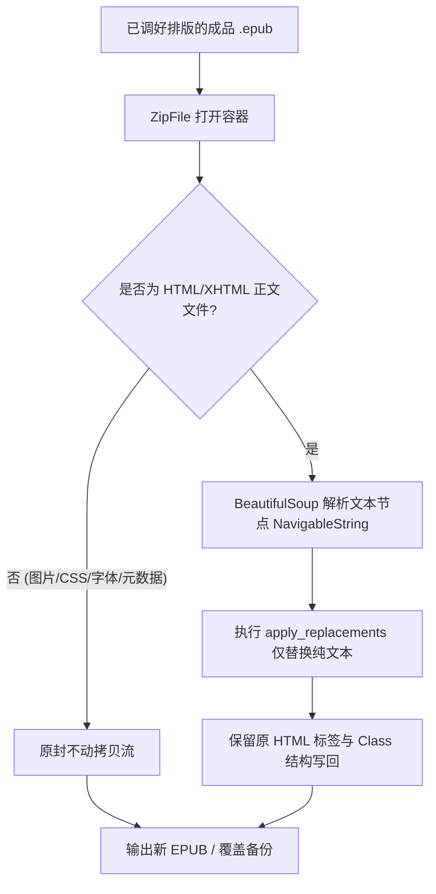

# 成品 EPUB 词表无损矫正（In-Place Glossary Fixer）设计方案

## 一、 背景与用户痛点

1. **典型场景**：
   - 用户已经导出了翻译好的 EPUB，甚至在 Sigil/Calibre 等工具中精细配置好了封面、插图位置、多级目录或自定义 CSS 排版样式。
   - 随后人工校对词表时，发现某个主要角色的译名需要修正（例如：将历史译名“俊希”全量修正为已确认的“俊熙”）。
2. **诉求**：
   - 无需重新跑整本翻译或重新合并。
   - 传入“成品 EPUB” + “最新词表”，直接将书籍内部的可能译名替换为确认译名。
   - **关键要求**：必须 100% 保持用户已调校好的封面、插图、排版、CSS 样式与目录结构不受任何破坏。

---

## 二、 技术可行性与现有模块复用评估

### 1. 100% 复用现有词表替换引擎
- **`glossary.replacement_pairs()`**：直接复用已有逻辑。仅导出 `confirmed=True` 词条的 `alternatives` / `zh_history` $\rightarrow$ `zh` 映射对，绝对不会发生未确认词条的误替换。
- **`glossary.apply_replacements(text)`**：直接复用单段文本替换函数。

### 2. 原地无损容器替换（In-Place Zip/HTML Patching）架构
为了避免重新生成 EPUB 破坏用户已调好的排版与静态资源，采用**原地 Zip 流式更新方案**：



---

## 三、 界面设计（新增 “成品矫正” Tab）

### 1. UI 布局元素
- **输入区域**：
  - `成品 EPUB 路径`（支持文件选择器与拖拽）
  - `当前关联词表`（展示当前已加载词表的有效/确认条目数）
- **预检变更面板（Treeview / 文本框）**：
  - 点击 **“🔍 预检变更”**，展示即将在全书中发生的修改详情：
    - 示例：`[第3章] "俊希" -> "俊熙" (出现 8 次)`
    - 示例：`[第12章] "文浩哲" -> "文浩澈" (出现 3 次)`
- **输出选项**：
  - `☑ 另存为新文件 (_fixed.epub)` 或 `☐ 原地覆盖（自动生成 .bak 备份）`
- **操作按钮**：
  - **“⚡ 开始无损矫正”**（毫秒级完成）

---

## 四、 核心实现伪代码

```python
import zipfile
from bs4 import BeautifulSoup, NavigableString
from hangul_novel_translator.glossary import Glossary

def fix_finished_epub_in_place(
    epub_path: Path,
    glossary: Glossary,
    output_path: Path,
) -> dict[str, int]:
    """对已完成排版的成品 EPUB 进行原地词表无损修正，不破坏封面/CSS/图片。"""
    pairs = glossary.replacement_pairs()
    if not pairs:
        return {"hit_count": 0, "modified_files": 0}

    stats = {"hit_count": 0, "modified_files": 0}
    
    with zipfile.ZipFile(epub_path, "r") as zin, zipfile.ZipFile(output_path, "w", zipfile.ZIP_DEFLATED) as zout:
        for item in zin.infolist():
            content = zin.read(item.filename)
            # 只对正文 xhtml/html 执行文本节点替换
            if item.filename.lower().endswith((".xhtml", ".html", ".htm")):
                soup = BeautifulSoup(content, "html.parser")
                file_modified = False
                for node in soup.find_all(text=True):
                    if isinstance(node, NavigableString) and node.parent.name not in ("script", "style"):
                        original_text = str(node)
                        fixed_text = glossary.apply_replacements(original_text)
                        if fixed_text != original_text:
                            node.replace_with(fixed_text)
                            file_modified = True
                            stats["hit_count"] += sum(1 for src, _ in pairs if src in original_text)
                
                if file_modified:
                    stats["modified_files"] += 1
                    content = str(soup).encode("utf-8")
                    
            zout.writestr(item, content)
            
    return stats
```

---

## 五、 方案优势

1. **超高安全性与排版保真度**：
   - 采用纯文本节点（`NavigableString`）替换，正文中的 HTML 标签、CSS 类名、内联样式、图片路径、目录文件完全保持原样，不发生任何位移或重排。
2. **极速体验**：
   - 纯本地 CPU 字符串流式处理，一部 100 万字的小说矫正耗时仅需 **0.3~0.8 秒**，无需调用任何 LLM。
3. **零影响后端**：
   - 作为一个独立的扩展工具模块，与翻译、分块、多卷合并完全解耦。
