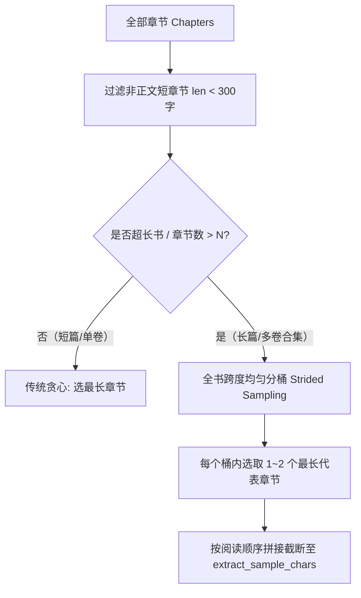

# 专有名词全书跨度采样（Strided/Distributed Sampling）设计方案

## 一、 现状与痛点

1. **当前采样机制**：
   - 现有的 `collect_sample_text`（位于 `hangul_novel_translator/translator.py`）仅将整部作品中所有章节按字数从多到少排序，取最长的前 6 章（累计最多 30,000 字）。
2. **多卷合一/超长 EPUB 场景下的局限**：
   - **样本时空集中**：取最长章节往往集中在小说的开篇或前中期部分重点章节。
   - **后半部人物遗漏**：对于 50~200 万字的大合集小说，中后期登场的重要角色、宗门、阵营、核心术语在开头的 3 万字样章中完全没有出现，导致自动提取的基础词表产生断层。

---

## 二、 核心设计目标

1. **全书时空均匀覆盖（Temporal / Strided Coverage）**：
   - 保证采样点均匀分布在全书的各个阅读进度区间（例如：前部、中前、中部、中后、大结局）。
2. **规避短垃圾文件（Noise Filtering）**：
   - 依然有效过滤封面、版权页、目录等极短非正文文件（如过滤字数 < 300 字的章节）。
3. **保持 Token 与字符预算可控**：
   - 总采样字符数仍维持在用户配置的上限（默认 30,000 ~ 50,000 字），不增加 LLM 额外上下文负担。

---

## 三、 采样算法设计

### 1. 算法流程（三步法）



### 2. 核心采样逻辑伪代码

```python
def collect_sample_text_strided(
    book: Book,
    config: AppConfig,
    min_chapter_len: int = 300,
) -> str:
    """按全书跨度均匀采样章节，确保多卷合集从头到尾的专有名词都能被捕捉。"""
    # 1. 过滤掉封面、目录、版权声明等过短文档
    valid_chapters = [
        (idx, ch) for idx, ch in enumerate(book.chapters)
        if len("".join(ch.paragraphs)) >= min_chapter_len
    ]
    if not valid_chapters:
        valid_chapters = list(enumerate(book.chapters))
    
    total_valid = len(valid_chapters)
    target_count = min(config.extract_sample_chapters, total_valid) # 默认 6~8 章
    
    # 2. 如果章节较少，直接退化为常规最长采样
    if total_valid <= target_count:
        selected_chapters = [ch for _, ch in valid_chapters]
    else:
        # 3. 均匀分桶跨度采样 (Strided Sampling)
        # 例如分 6 个桶：[0~16%], [16~33%], [33~50%], [50~66%], [66~83%], [83~100%]
        selected_chapters = []
        bucket_size = total_valid / target_count
        for b in range(target_count):
            start = int(b * bucket_size)
            end = int((b + 1) * bucket_size) if b < target_count - 1 else total_valid
            bucket = valid_chapters[start:end]
            # 每个桶挑一个最长/最具代表性的章节
            best_idx, best_ch = max(bucket, key=lambda item: len("".join(item[1].paragraphs)))
            selected_chapters.append((best_idx, best_ch))
        
        # 重新按书籍原始出现顺序排序
        selected_chapters.sort(key=lambda item: item[0])
        selected_chapters = [ch for _, ch in selected_chapters]

    # 4. 按配额拼接正文文本，达标截断
    sample = []
    chars = 0
    per_chapter_quota = max(3000, config.extract_sample_chars // len(selected_chapters))
    
    for ch in selected_chapters:
        ch_chars = 0
        for p in ch.paragraphs:
            text = strip_inline_markers(p).strip()
            if not text:
                continue
            sample.append(text)
            chars += len(text)
            ch_chars += len(text)
            if chars >= config.extract_sample_chars or ch_chars >= per_chapter_quota:
                break
        if chars >= config.extract_sample_chars:
            break
            
    return "\n".join(sample)
```

---

## 四、 优势与预期收益

1. **解决全书人物断层**：
   - 即便用户直接拖入 200 万字 10 卷合并的 EPUB，采样也能覆盖卷 1、卷 3、卷 5、卷 7、卷 9、卷 10 的核心篇章，主线角色的名称与人设昵称一网打尽。
2. **多卷/单卷行为统一**：
   - 单卷普通小说天然回退为最重要篇章采样；超长多卷小说自动启动分桶均匀覆盖，无需用户手动在设置中来回切换模式。
3. **零影响翻译核心**：
   - 采样仅作为数据预处理输入给 LLM 词表提取，翻译主流程与多线程翻译单元完全解耦，安全性 100%。

---

## 五、 实现现状与默认参数

当前实现（`hangul_novel_translator/sampling.py`）在“跨度分桶”基础上增加了：

1. **前/中/后三区域覆盖**：默认 `extract_sample_regions=3`、`extract_sample_per_region=2`，先按阅读顺序切成连续区域，再从每个区域挑最长代表章，保证开头、中段、结尾都有采样。
2. **预算随书长放大**：默认 `extract_sample_chars=30000` 为下限，每满 10 万字符追加 `extract_sample_chars_per_100k=20000`，总预算封顶 `extract_sample_chars_cap=60000`，避免只抽到开头的 3 万。
3. **抽样章数随预算增加**：预算越大，每区抽取章数越多（按区域数换算），长书/多卷合集能抽到 10~12+ 章，而不是固定 6 章。
4. **分章校验输出**：提取词表日志会打印 `抽样章数/全书章数、样本字数/全书字数、位置、进度跨度、覆盖是否达标`，让跨度采样效果可观测。

> 说明：60,000 字符预算约对应 2~4 万 token，适配大多数高上下文模型；若模型上下文很小，可下调 `extract_sample_chars_cap`。
